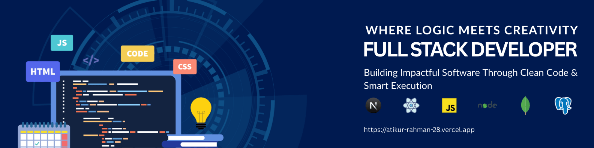

---

## Hi, I'm Atikur Rahman Sakib  
### Full Stack Web Developer | MERN • Next.js

I am a passionate **Full Stack Web Developer** focused on building **scalable, high-performance, and production-ready web applications**.  
I care deeply about **clean architecture, maintainable code, optimized performance, and real-world problem solving**.

I believe great software is not just written — it is **engineered**.

---

## What I Do
- Build complete full-stack web applications
- Design clean, responsive, and user-focused UI
- Develop secure and scalable backend APIs
- Work with relational & NoSQL databases
- Deploy, monitor, and maintain production apps

---

## Featured Projects

1. **LuxOra – Premium Fashion & Lifestyle Platform**
   Live: https://luxora-kappa.vercel.app  
   A modern, high-performance, and secure e-commerce platform built with Next.js & TypeScript, featuring multi-language support, theme customization, encrypted payments, and a smooth, responsive shopping experience designed for scalability and reliability.
   
2. **InnovateHub – Online Contest Platform**  
   Live: https://contest-hub-6df80.web.app  
   A full-stack contest management platform with role-based dashboards, secure authentication, payment-based registrations, and dynamic contest discovery—built to connect admins, creators, and participants seamlessly.

3. **HungryHarmony – Restaurant Platform**  
   Live: https://hungry-harmony.web.app  
   A responsive restaurant and food-ordering platform offering smart search, pagination, secure ordering, user dashboards, and a smooth checkout flow for an efficient and user-friendly dining experience.
---

## Tech Stack & Skills

  

### Frontend
- HTML5, CSS3, JavaScript (ES6+)
- React.js
- Tailwind CSS

### Backend
- Node.js
- Express.js
- RESTful API Development
- Authentication & Authorization

### Database
- MongoDB
- PostgreSQL

### ORM
- Prisma

### Tools & Workflow
- VS Code
- Postman
- Git & GitHub
- Vercel (Deployment)

---

## Currently
- Learning **PostgreSQL** deeply for scalable relational database design
- Improving backend architecture using **Prisma ORM**
- Exploring best practices for performance and security

---

## GitHub Analytics

 

 

## Connect With Me

  
  

---

### Clean Code • Scalable Systems • Full Stack Engineering
