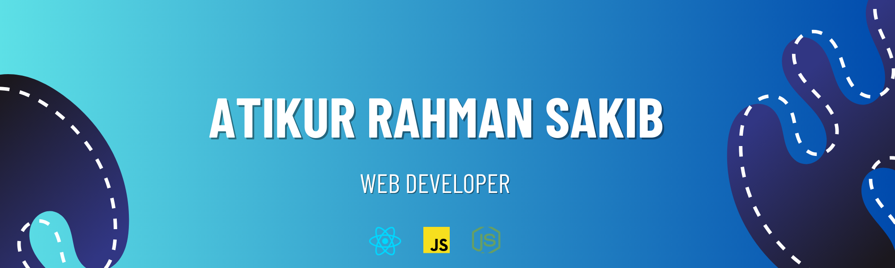

***
### Hi, I'm Atikur Rahman Sakib 👋
- 👑 I am a Font-End Web Developer.
- 🖊 Love to write code.
- 🎤 Like to share my knowledge.

I am a Font End Web Developer who is passionate  of making error free websites. I have passion for learning and sharing my knowledge with others as publicly.

### 🧾 Projects: 
***
1. **HungryHarmony Restaurent:** [Live Link](https://hungry-harmony.web.app/)
2. **InnovateHub - Contest Platform:** [Live Link](https://contest-hub-6df80.web.app/)
3. **TechHub - Your Premier Brand Shop for Tech Enthusiasts:** [Live Link](https://tech-electro-hub.web.app/)

#### 👨‍💻 Skills: 
***

  

- 🌱 I’m currently learning Next.js 
- 💬 Ask me about Web Development

#### ☕ Connect with me:
***

 

